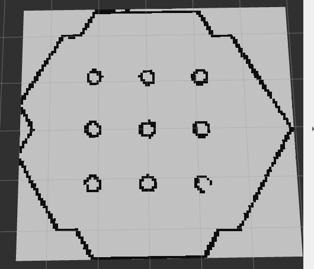
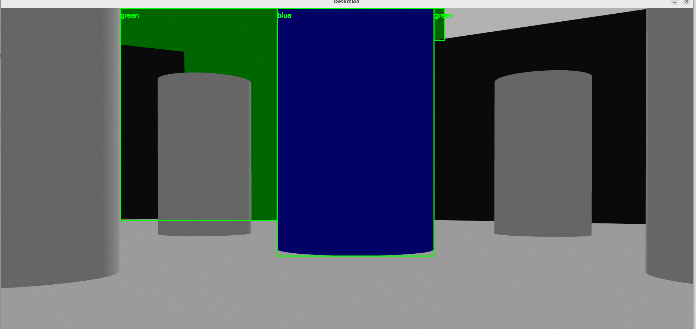
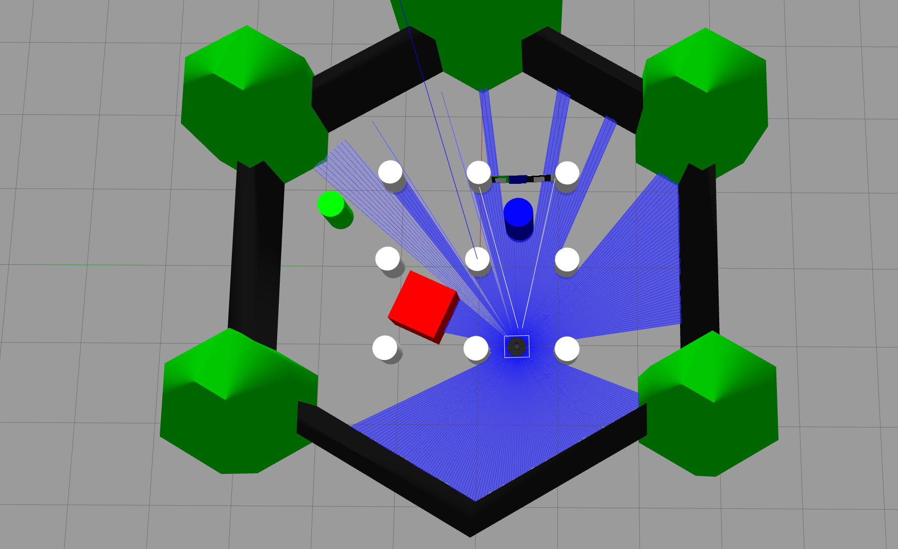

# 基于ROS2的移动机器人自主导航与目标搜寻系统

项目阶段性成果整理

---

## 项目简介

基于 TurtleBot3（Gazebo仿真）+ ROS2 Humble 搭建的移动机器人系统，实现了从仿真环境搭建、SLAM建图、Nav2自主导航，到视觉目标检测、感知-导航联动的完整闭环——机器人能够实时检测指定颜色的目标物体，自主计算其在地图中的位置，并规划路径自主导航过去。

---

## 已完成功能

### 1. 仿真环境与自主导航

- 基于 TurtleBot3 Waffle 官方模型，在 Gazebo 中搭建仿真场景，验证雷达、摄像头等传感器数据正常发布
- 使用 `slam_toolbox` 完成 SLAM 建图，通过 Nav2 实现给定目标点的自主路径规划与避障导航

**建图效果：**

*地图完整覆盖场景轮廓，9个障碍物位置清晰可辨，边界干净无明显噪声*

**Nav2自主导航演示视频**：[nav2_navigation_demo.webm](videos/nav2_navigation_demo.webm)

---

### 2. 视觉目标检测

- 基于 HSV 颜色空间，将原有的 OpenCV 颜色检测算法通过 `cv_bridge` 接入 ROS2 摄像头话题，实现实时检测
- 支持红/绿/蓝/黄四种颜色目标的识别、框选与标注

**检测效果：**

*绿色、蓝色目标均被准确框出并标注颜色标签，检测框贴合目标边界*

---

### 3. 感知-导航联动闭环（第5周）

这是本阶段的核心成果——实现了"视觉检测目标 → 计算目标地图坐标 → 自主导航抵达"的完整闭环，技术方案：

- **视觉定方向**：通过目标在图像中的像素位置，结合摄像头水平视场角（FOV）计算目标相对机器人的角度偏移
- **雷达定距离**：按计算出的角度查询激光雷达（LaserScan）数据，获取该方向的实际距离
- **坐标系转换**：通过 `tf2` 将目标从机器人本体坐标系（base_link）转换到地图坐标系（map）
- **自主导航**：将转换后的坐标封装为 Nav2 Action 目标点，通过 `NavigateToPose` Action 发送并监听执行结果

**测试场景**（红色目标物单独放置于场地开阔区域，验证长距离自主导航能力）：

*机器人（画面中心）需要穿越场地并绕开多个障碍物，才能到达左下方的红色目标*

**感知+导航联动演示视频**：[perception_navigation_demo.webm](videos/perception_navigation_demo.webm)

---

## 关键问题排查记录

开发过程中排查并解决的几个典型工程问题，体现调试与问题定位能力：

| 问题 | 排查过程 | 解决方法 |
|---|---|---|
| `world:=` 参数不生效，无论怎么传都加载默认场景 | 直接查看 launch 文件源码，发现world路径写死，未声明为可传入的 launch argument | 修改 launch 文件，用 `DeclareLaunchArgument` 正确声明 world 参数 |
| 目标坐标计算严重偏离（像素中心值远超画面宽度） | 检查发现代码里摄像头分辨率写死为640，与实际运行分辨率不符 | 通过 `ros2 topic echo /camera/image_raw` 查实际分辨率（1920x1080），修正代码参数 |
| 机器人计算出目标点后拒绝导航，无任何异常但一直不动 | 补充 Nav2 Action 的目标响应回调，才发现是"目标被拒绝"但代码原本没有捕获这个状态 | 增加 `goal_response_callback`，明确打印目标接受/拒绝状态，便于后续排查 |
| 机器人无法靠近目标，导航后停留距离过远 | 用 `ros2 param get` 直接查询运行中Nav2节点的实际生效参数，定位到 costmap inflation_radius 高达1.0米 | 调整 `inflation_radius` 至更合理的0.3米，重启Nav2验证生效 |
| 目标距离过近时导航请求被反复跳过 | 定位到激光雷达存在最小探测距离（range_min），过近距离读数被判定无效 | 确认为正常传感器限制，通过手动调整机器人与目标初始距离规避 |

---

## 技术栈

- **仿真与机器人系统**：ROS2 Humble、Gazebo、TurtleBot3 (Waffle)
- **导航与建图**：Nav2、slam_toolbox、costmap_2d
- **感知**：OpenCV（HSV颜色检测）、cv_bridge
- **坐标与通信**：tf2、Action通信（NavigateToPose）
- **开发环境**：Ubuntu 22.04

---

## 后续计划

- [ ] 引入 YOLOv8 轻量目标检测，替代/补充颜色检测方案，提升检测鲁棒性
- [ ] 尝试基于 PPO 的强化学习端到端导航（本地CPU训练或借助Colab GPU）
- [ ] 补充自然语言指令解析，实现"给定一句话指令→自主完成任务"的具身智能demo

---

*本文档为项目阶段性整理，最终版本将随项目进度持续更新至GitHub仓库。*
